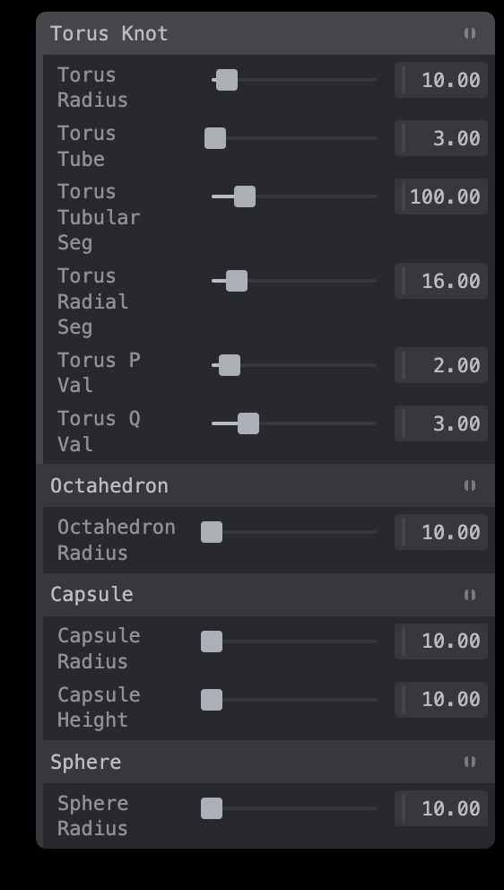

# AudioMesh

Connor Finnegan

## Description

Inspired by the interactive exhibits at the WNDR musuem like the mesh wall and particle floor, I wanted to create something that combined those aspects with sound to create mini songs snippets. AudioMesh offers a fully interactive sandbox where you can use different adjustable geometries to try adn create unique sounds and potentially songs! It inspires both interesting and random art and creation

## Technology

The geometries are created using threejs. Each geomtry is fully customizable. Using tweakpane to change any of the input parameters for the geomtry. 

using strudel to handle all of the sounds and notes associated with the geometries. Using different sounds samples to play notes based on the size of each shape.

[strudel documentation](https://strudel.cc/workshop/getting-started/)

[Link to tidal cycles sample](https://github.com/tidalcycles/Dirt-Samples/tree/master)

[Link to dough sample](https://github.com/felixroos/dough-samples/tree/main)

## Installing/Running

clone the repository

    git clone https://github.com/cfinnegan827/AudioMesh

Initilize npm

    npm install

Run the site

    npm run dev

The site will host on  http://localhost:5173/

## Interacting
To start with the base sounds you first will need to click anywhere on the canvas. Then you will hear the base sounds.

You can freely adjust the all parameters of each shape using the ui on the right side of the screen.

The addition of geometries is done by logging the last key pressed. 

- w: torus knot
- e: octahedron
- s: capsule
- d: sphere

To place the geomtry you will need to click the key of the associated shape you want to palce into the scene, then click the shift key and then click on the scene to add the geomtry.

Without holding shift you will be able to move freely. The Scene is fully 360 meaning you can add geomtries while facing any direction.

## Implementation Challenges

There was a hard issue where, since speed is based on the number of notes the more notes you add to a sequence the more inaudible it would sound. I played around with different strudel functions like slow, fast, cpm, but none of those solved the problem and where best used for other features. To combat that I decided to set a hard limit of ten notes in a sequence, the geometries would still be present in the scene but the oldest note gets popped off the sequence and the new note added. this helped fixed the speed problem though now the complexity of a sound sequence could be limited.

Another issue was certain imported sounds could be louder and overshadow other ones. This was just a ear test seeing which sounds sounded better as more background/softer sounds versus louder. I used the strudel lpf function that you can set values to deafen the sounds with an integer value.
